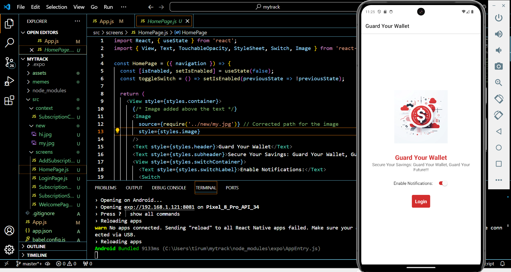
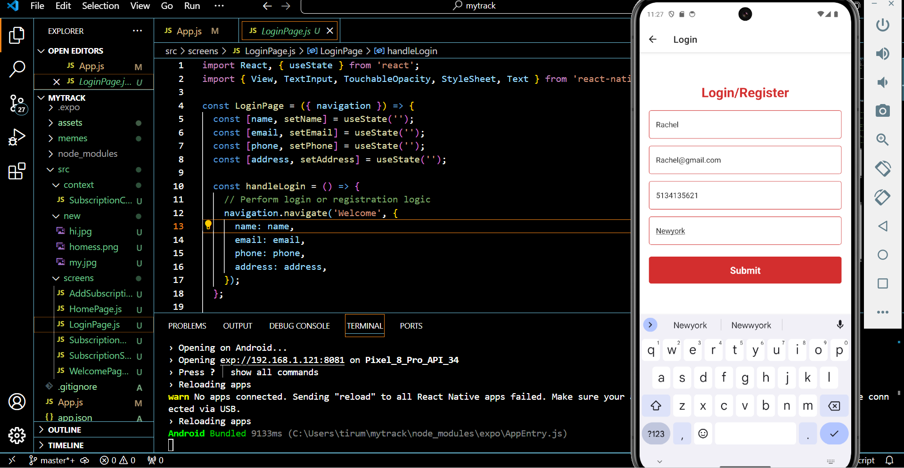
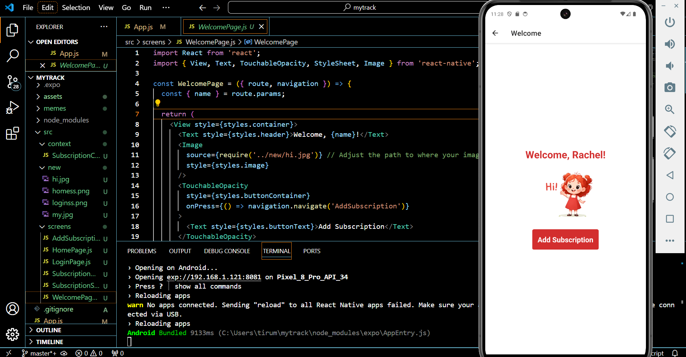
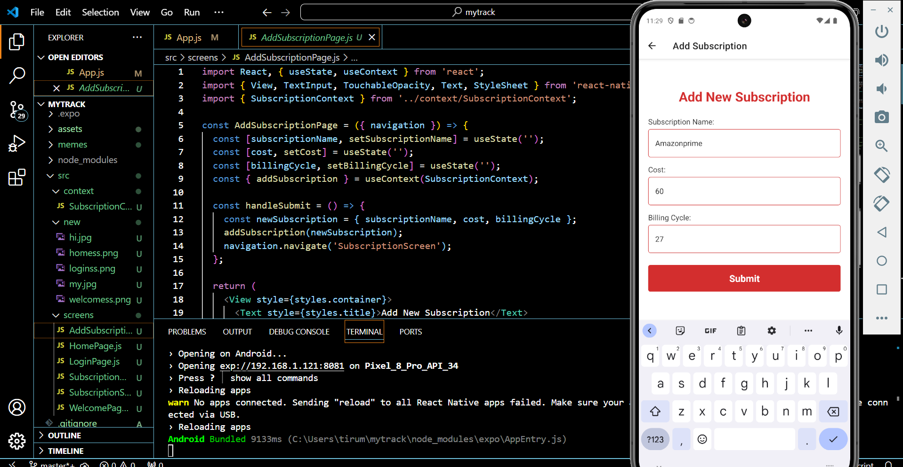
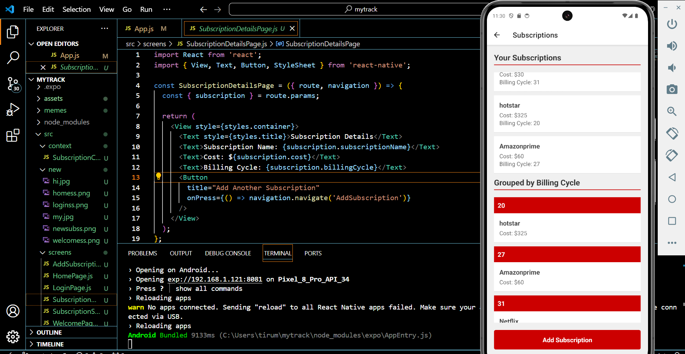

# GUARD YOUR WALLET

## Personal Mobile App Project Final

## Team Members

## Likhitha Tirumalaredy , Jyothi Sree kottem

## Email: tirumala@mail.uc.edu,kottemje@mail.uc.edu

# Overview

## The "Guard Your Wallet" project is a React Native mobile application focused on helping users manage their subscriptions effectively. It offers features like user authentication, where users can securely log in or register, and subscription management, enabling users to add, view, and potentially update or delete their subscriptions. Key functionalities include adding subscription details such as service name, cost, and billing cycle, and a subscription screen that lists all subscriptions for easy monitoring. Personalized elements, like a welcome page that greets users by name and contextual navigation throughout the app, enhance the user experience. The app integrates React components, hooks, and context for state management, and utilizes React Navigation for seamless screen transitions, providing a comprehensive tool for financial oversight and subscription tracking.

## Presentation Video

https://mailuc-my.sharepoint.com/personal/tirumala_mail_uc_edu/_layouts/15/stream.aspx?id=%2Fpersonal%2Ftirumala_mail_uc_edu%2FDocuments%2FMicrosoft%20Teams%20Chat%20Files%2FPersonal_%20MobileApp%2Emp4&nav=eyJwbGF5YmFja09wdGlvbnMiOnsic3RhcnRUaW1lSW5TZWNvbmRzIjo2LjM4NzMwNH19&referrer=Teams%2EWin32&referrerScenario=PopOut%2Eview%2Ee64a4f3e-c5e9-45c1-b7f1-f947b6286b68

## Screenshots of the workflow

The "Guard Your Wallet" app utilizes a well-structured navigation system designed to enhance user experience through seamless transitions between screens within the application. Starting from the HomePage, users are introduced to the app's main features and directed towards the LoginPage where they can either log in or register. Once authenticated, users arrive at the WelcomePage, which greets them by name and offers direct access to manage their subscriptions. From here, users can navigate to the AddSubscriptionPage to enter new subscription details, or move to the SubscriptionScreen to view a comprehensive list of all their subscriptions. The SubscriptionScreen also links to detailed views of individual subscriptions on the SubscriptionDetailsPage, where further actions can be taken. This intuitive navigation flow ensures that users can easily manage their subscriptions without hassle, enhancing the overall functionality and user-friendliness of the app. Here are screenshots:

## Screenshots 

## Home Page: Introduces "Guard Your Wallet" with a call-to-action for users to log in and start managing their subscriptions.

## Login Page: Allows users to securely log into their account to access subscription management features.

## Welcome Page: Greets users by name and offers a direct pathway to managing their subscriptions.

## Add Subscription Page: Provides a form for users to enter and submit new subscription details seamlessly.

## Subscription Details Page: Displays detailed information about a specific subscription, allowing users to view or modify subscription data.

